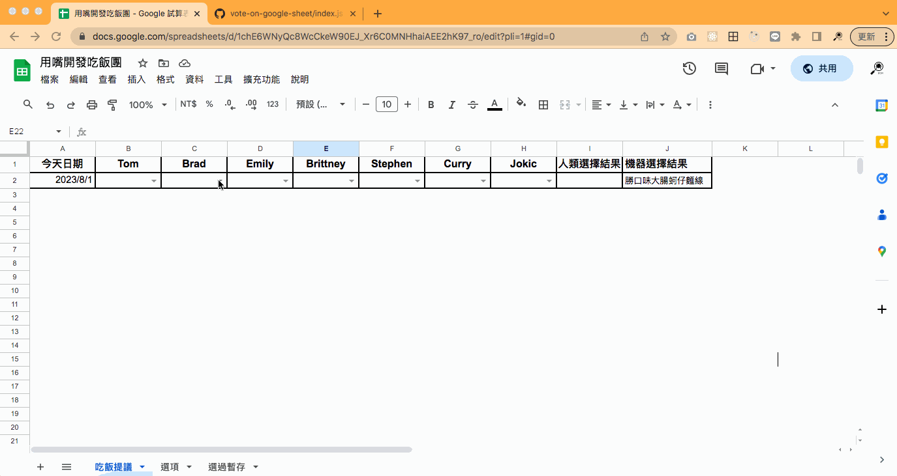
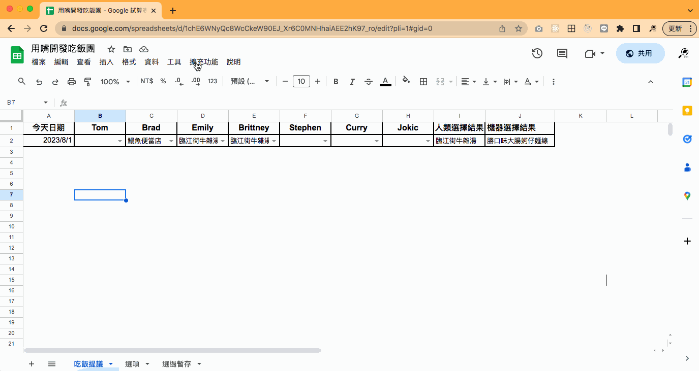
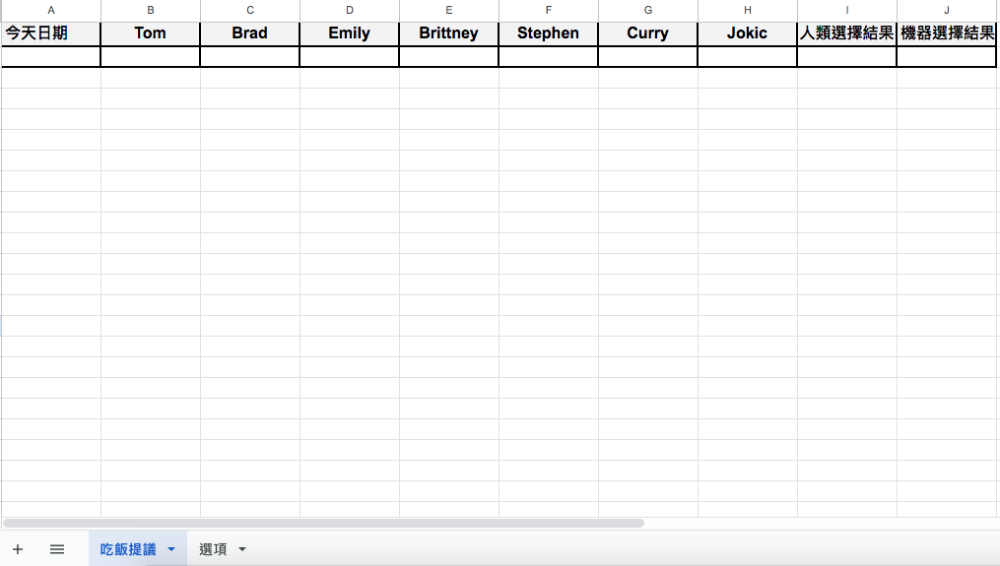
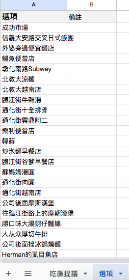
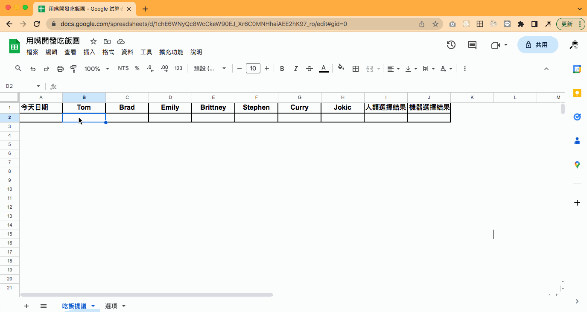
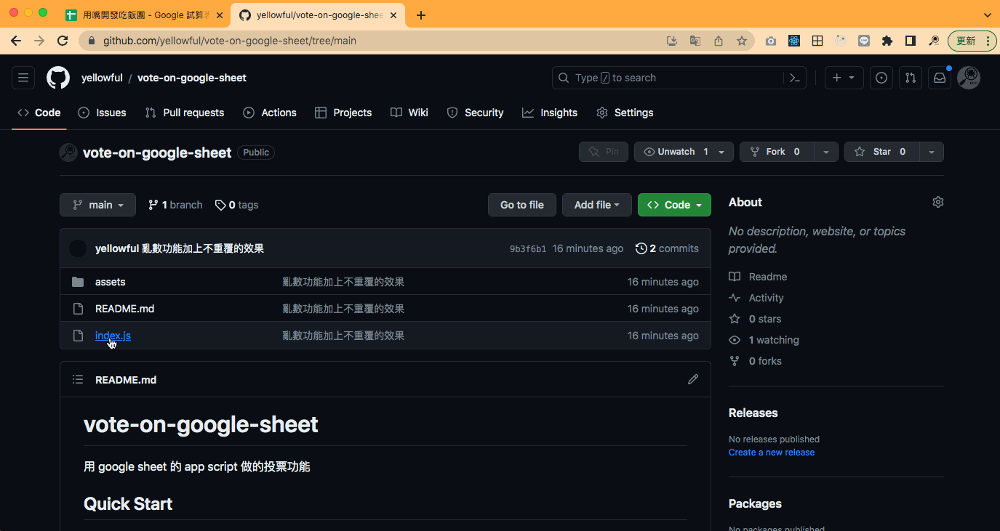
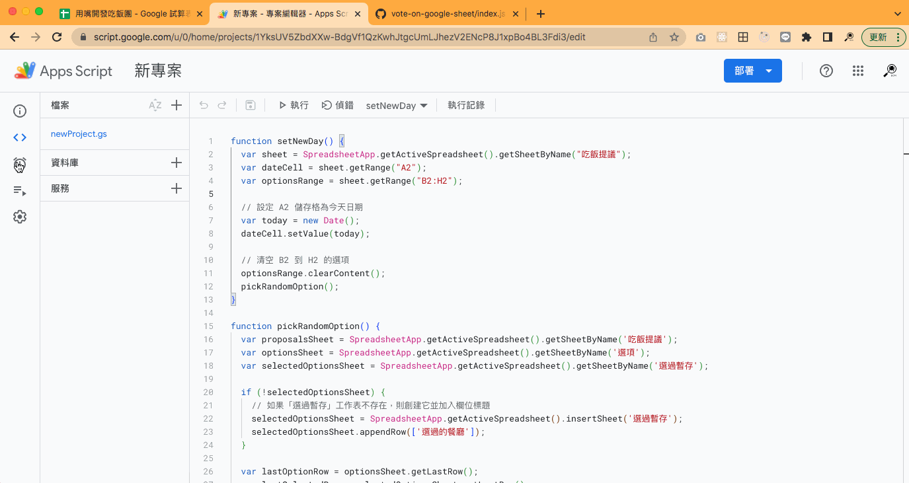

# 投票決擇器

用 google sheet 的 app script 做的投票功能

## 功能

- 一群人可以投票決定一件事情，例如午餐吃什麼
  
- 沒人投票時，電腦會自動決定一個選項
- 可以手動執行 App Script 自動清除上次投票資料和結果
  
- 可以設定每天自動執行一次
- 選項不會重複，除非所有選項都被選過了，才會重新開始

## Quick Start

1. 建立一個 google sheet 的表格，取名`吃飯提議`，並分享給要投票的人，給予編輯權限，[參考範例](https://docs.google.com/spreadsheets/d/1chE6WNyQc8WcCkeW90EJ_Xr6C0MNHhaiAEE2hK97_ro/edit?usp=sharing)
   
2. 建立選項表格和選項資料，表格名稱取名`選項`  
   
3. 欄位`A2`到`H2`建立選項功能
   
4. 投票功能：到`I2`欄位貼上公式`=INDEX(B2:H2, 1, MATCH(MAX(COUNTIF(B2:H2, B2:H2)), COUNTIF(B2:H2, B2:H2), 0))`
5. 將 Github 上`index.js`的[程式碼](https://github.com/yellowful/vote-on-google-sheet/blob/main/index.js)複製到[google sheet](https://docs.google.com/spreadsheets/d/1chE6WNyQc8WcCkeW90EJ_Xr6C0MNHhaiAEE2hK97_ro/edit?usp=sharing)的  App Script 上
   

   - 貼上程式碼後存檔，並執行`setNewDay`一次
   - 第一次執行會要求授權，請授權
   - 執行完看到`A2`和`J2`欄位有填入東西了，代表成功了

6. 設定每天自動執行`setNewDay`：不用每天投票的話，不用做這一個步驟。選擇`觸發條件`->`新增觸發條件` -> `選取活動來源` -> `時間驅動` -> `選取時間型觸發條件類型` -> `日計時器` -> `選取時段` -> `上午 08 點到上午 9 點` -> `儲存`
   

## 調整設定

1. 欄位名稱可任意修改不用動程式
2. google sheet 的欄位**數量**有增減、**表格名稱**有改變，請對應調整兩個地方
   1. `I2`欄位的公式。以下為ChatGPT prompt 範例：

      ```plaintext
      我在Google Sheet上有一個欄位`J2`用來計算`B2`到`H2`的投票結果，公式是這樣
      `
      =INDEX(B2:H2, 1, MATCH(MAX(COUNTIF(B2:H2, B2:H2)), COUNTIF(B2:H2, B2:H2), 0))
      `
      請幫我修改成`B2`到`D2`的投票結果
      ```

   2. App Script 的`setNewDay`函式。以下為ChatGPT prompt 範例：

      ```plaintext
      我在Google Sheet 的 App Script 如下
      `
      程式碼略...
      `
      我的`吃飯提議`表裡的`B2`到`H2`欄已縮減為`B2`到`D2`欄，原本吃飯提議請改到`F2`欄，請幫我修改上面的程式碼
      ```

3. 每天自動執行的時間，請在`觸發條件中`自行調整
